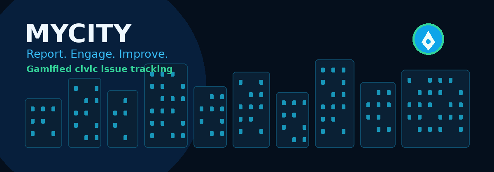

<div align="center">



# 🏙️ MyCity

### **Report. Engage. Improve.**

**A gamified civic issue tracking platform connecting citizens, authorities, and administrators.**

<p>
  
  
  
  
  
</p>

</div>

---

## 🌆 The Idea

> **MyCity turns civic complaints into visible progress.**

Instead of a citizen reporting a problem and wondering what happened next, MyCity creates a connected flow:

**📍 Report → 🔍 Review → 🛠️ Resolve → ✅ Track → 🏆 Reward**

The platform brings the people who **experience civic problems**, the teams who **resolve them**, and the administrators who **oversee the ecosystem** into one place.

---

## ⚡ What MyCity Does

| 👤 Citizens | 🏛️ Authorities | 🛡️ Admins |
|---|---|---|
| Report issues | Review reports | Manage users |
| Add location | Update status | Manage platform |
| Upload evidence | Resolve issues | Monitor activity |
| Upvote problems | Track workload | Maintain oversight |
| Earn points | Close issues | Control roles |
| Unlock badges | Improve response | Analyze ecosystem |

---

## 🎮 Gamified Civic Participation

MyCity adds a positive engagement layer to civic reporting.

```text
        📝 REPORT
            │
            ▼
       ⭐ EARN POINTS
            │
            ▼
       🏅 UNLOCK BADGES
            │
            ▼
       🥇 LEADERBOARD
            │
            ▼
      🤝 MORE PARTICIPATION
            │
            └──────────────► 📝 REPORT
```

### 🏆 Engagement Loop

**Report** an issue → **Support** important issues → **Earn** civic points → **Unlock** achievements → **Climb** the leaderboard.

> Gamification is designed to encourage **meaningful civic participation**, not simply maximize activity.

---

## 🧭 Issue Reporting Journey

```text
┌──────────────┐
│ 01  CATEGORY │
└──────┬───────┘
       ↓
┌──────────────┐
│ 02  DETAILS  │
└──────┬───────┘
       ↓
┌──────────────┐
│ 03  PHOTO 📸 │
└──────┬───────┘
       ↓
┌──────────────┐
│ 04 LOCATION 📍│
└──────┬───────┘
       ↓
┌──────────────┐
│ 05  REVIEW   │
└──────┬───────┘
       ↓
     🎉 DONE
```

A guided multi-step experience keeps reporting simple while collecting the information required for effective resolution.

---

## 🔄 Transparent Issue Lifecycle

```text
📝 REPORTED
     │
     ▼
🔍 REVIEWING
     │
     ▼
🛠️ IN PROGRESS
     │
     ▼
✅ RESOLVED
```

Citizens can understand where an issue stands instead of being left with an unanswered complaint.

---

## 🗺️ Location-Aware Civic Reporting

**Leaflet** connects reports to real-world locations.

- 📍 Pin the issue location
- 🧭 Provide geographic context
- 🗺️ Visualize civic problems
- 👀 Understand nearby issues

---

# 🎨 Design Language

MyCity uses a **modern civic-tech + gamification** visual direction.

### Core visual principles

**🌌 Trust** — deep blue foundations  
**💠 Action** — sky-blue interactions  
**🌱 Progress** — emerald success states  
**🪟 Depth** — layered/glass-inspired surfaces  
**✨ Feedback** — purposeful motion  
**🏆 Reward** — energetic achievement states

### 🎨 Brand Palette

| Token | Hex | Role |
|:---|:---:|:---|
| Sky 400 | `#38BDF8` | Bright highlights |
| Sky 500 | `#0EA5E9` | Primary accent |
| Sky 600 | `#0284C7` | Strong emphasis |
| Emerald 400 | `#34D399` | Progress |
| Emerald 500 | `#10B981` | Success |
| Emerald 600 | `#059669` | Strong success |

### 🌙 Theme System

The interface supports light and dark themes through semantic CSS variables and HSL-based design tokens.

| Token | Light | Dark |
|:---|:---:|:---:|
| `background` | `210 40% 98%` | `222 47% 5%` |
| `foreground` | `222 47% 11%` | `213 31% 91%` |
| `primary` | `217 85% 42%` | `199 89% 60%` |
| `secondary` | `210 40% 96%` | `222 47% 12%` |
| `accent` | `210 40% 94%` | `222 47% 14%` |
| `muted` | `210 40% 94%` | `222 47% 12%` |
| `border` | `214 32% 88%` | `222 47% 14%` |
| `destructive` | `0 72% 45%` | `0 84% 60%` |

---

## ✨ Motion System

The UI uses motion to communicate **entrance, progress, loading, feedback, and achievement**.

| Animation | Purpose |
|:---|:---|
| `fade-in` | Smooth content entrance |
| `accordion-down/up` | Expand/collapse transitions |
| `pulse-slow` | Subtle attention |
| `ripple` | Interaction feedback |
| `orbit` | Activity/loading |
| `sweep` | Progress/highlight |
| `hop` | Playful status motion |
| `drift` | Ambient movement |
| `drop-in` | Page-state entrance |
| `wordmark-pan` | Brand gradient movement |
| `badge-halo` | Reward emphasis |
| `badge-glare` | Achievement highlight |
| `badge-pop` | Reward reveal |
| `badge-twinkle` | Celebration |

> **Motion principle:** every animation should have a purpose — guide attention, explain state, or celebrate progress.

---

# 🧱 Technology Stack

```text
┌─────────────────────────────────────────┐
│              MYCITY APP                 │
├─────────────────────────────────────────┤
│ Next.js        → Application framework  │
│ TypeScript     → Type safety             │
│ Tailwind CSS   → Styling                 │
│ shadcn/ui      → UI components           │
│ NextAuth.js    → Authentication          │
│ Leaflet        → Maps                    │
│ CSS Variables  → Theming                 │
└─────────────────────────────────────────┘
```

---

# 📁 Project Structure

```text
mycity/
│
├── app/                 # Pages, layouts & API routes
├── components/          # Reusable UI & feature components
├── public/               # Static assets
├── app/globals.css       # Global styles & design tokens
├── tailwind.config.*     # Tailwind configuration
├── package.json          # Dependencies & scripts
├── .env.local            # Local secrets/configuration
└── README.md             # Project documentation
```

---

# 🚀 Getting Started

### Prerequisites

- Node.js
- npm
- Required environment variables

### Installation

```bash
git clone https://github.com/manishmotirale/mycity.git
cd mycity
npm install
```

### Environment

Create:

```text
.env
```

Add the environment variables required by your project's authentication, database, maps, and integrations.

### Run

```bash
npm run dev
```

Then open:

```text
http://localhost:3000
```

---

# 🔐 Security

- 🔑 Authentication protects user accounts.
- 👥 Role-based access separates citizen, authority, and admin workflows.
- 🔒 Secrets belong in environment variables.
- 🚫 Never commit `.env.local`.
- 📍 Handle location information only as required for civic functionality.

---

# 🏙️ The Vision

Traditional civic reporting often looks like:

```text
Problem
  ↓
Complaint
  ↓
Silence?
```

MyCity aims for:

```text
Problem
  ↓
📍 Report
  ↓
🔍 Review
  ↓
🛠️ Action
  ↓
📊 Progress
  ↓
✅ Resolution
  ↓
🏆 Recognition
```

### **Because a better city is built when citizens can participate, authorities can respond, and progress is visible.**

---

# 🔮 Future Scope

- 🤖 AI-assisted issue categorization
- 🧠 Duplicate report detection
- 🗺️ Civic issue heatmaps
- 🔔 Real-time notifications
- 📊 Authority performance analytics
- ⏱️ Resolution-time analytics
- 🌐 Multi-language reporting
- 📱 PWA/mobile experience
- ♿ Expanded accessibility
- 🔗 Public civic-data APIs

---

# 🤝 Contributing

```text
Fork
 ↓
Branch
 ↓
Build
 ↓
Test
 ↓
Pull Request
 ↓
Review
 ↓
Merge
```

Keep contributions aligned with the existing design system, responsive behavior, accessibility expectations, and security practices.

---

<div align="center">

## 🌍 **Build Better Cities. Together.**

### 🏙️ MyCity
**Turning civic problems into visible progress.**

<br/>

⭐ **Star the repository if you like the idea.**

</div>
